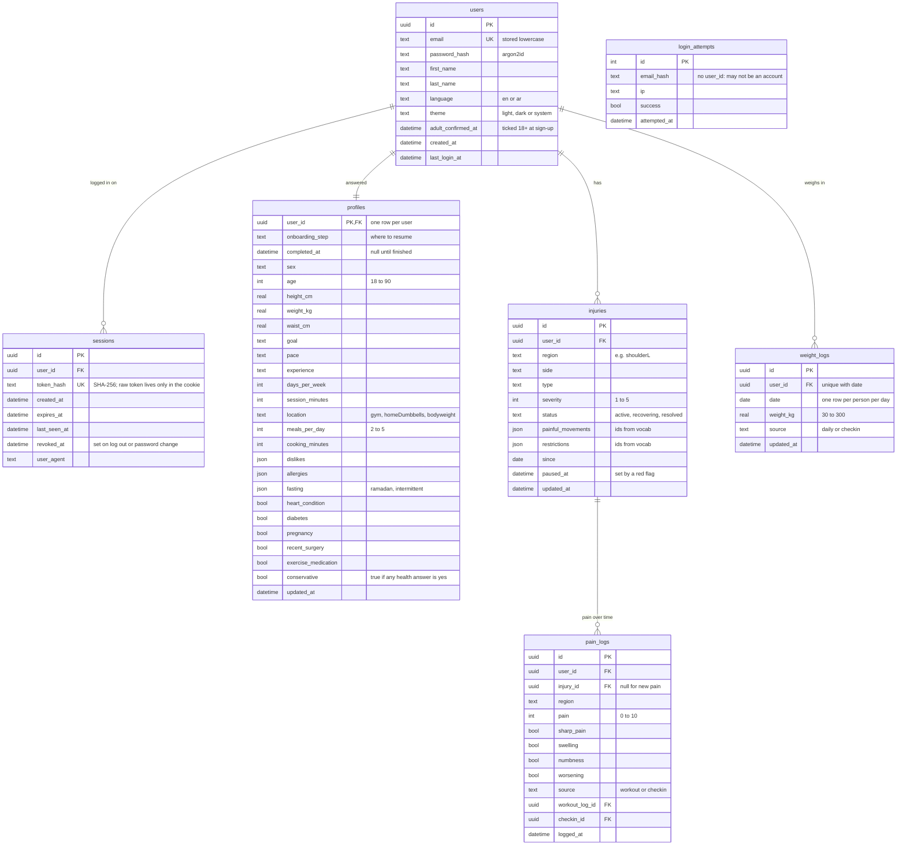
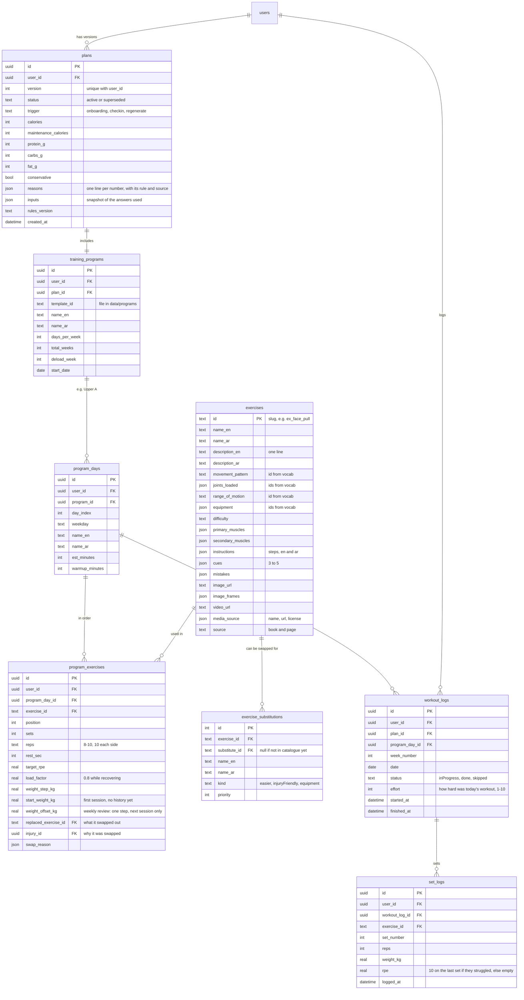
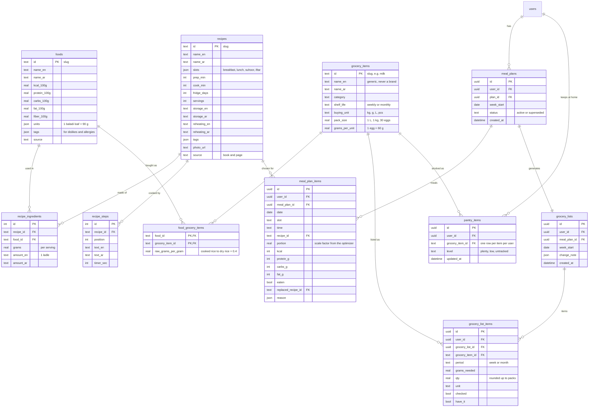
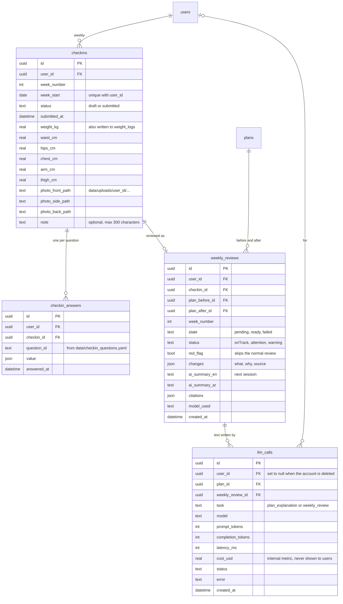
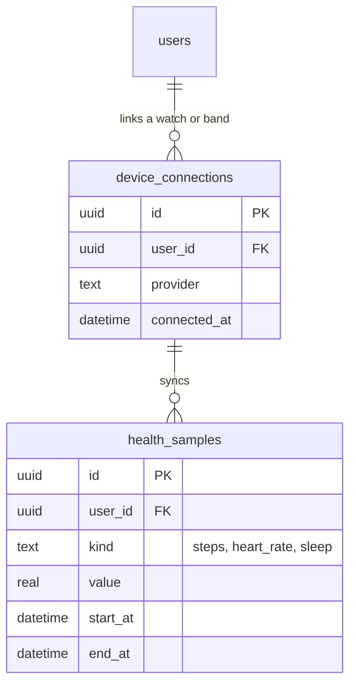

# Rafeqi database

Generated from the schema review. Diagrams are Mermaid; VS Code and GitHub show them as pictures.

## Accounts, profile and injuries

Who you are, how you log in, your questionnaire answers, and your injuries with their pain history.

## Plans and training

A plan is versioned: every change makes a new version and the old one stays for history. The program and its exercises hang off the plan, and your workout logs point back at them. Workouts are logged one result per exercise ("done as planned", or sets, reps and weight). Each result is saved as one `set_logs` row per set with the same reps and weight, and the session gets one effort rating. See `backend/app/workouts.py`.

## Food, meals and groceries

Foods, recipes and grocery items form a shared catalogue. Your weekly meal plan picks recipes and scales portions. The grocery list is generated from it, minus your pantry. There are no prices or brands anywhere.

## Check-ins, reviews and the AI log

The weekly check-in stores one row per answered question, so you can change the questions in YAML without touching the database. The review engine records every change it made and why. The AI text and its model are filled in next session.

## Later: smartwatches and fitness bands (not built yet)

## Decisions

- **Two kinds of tables.** **Catalogue** tables (exercises, substitutions, foods, grocery items, recipes and their parts) are shared by everyone. They're read-only for users and loaded from files in `data/`, so their IDs are readable slugs like `ex_face_pull`. **User-data** tables hold one person's information: 19 tables plus `users`.
- **One controlled list of movement and joint tags.** `data/vocab/movements.yaml` holds every movement pattern, joint, range of motion, equipment item, painful movement and restriction, each labelled in English and Arabic. Injuries are checked against it when they're saved, the exercise catalogue when it's loaded, and a test checks that the frontend's option lists only use these ids.
- **user_id on every user row, including child rows.** A logged set already belongs to a workout that belongs to you. It still stores `user_id` itself, so every query is a plain `WHERE user_id = me` with no joins to get wrong. One helper applies it everywhere, and the isolation tests try user B's IDs on every endpoint.
- **Random IDs (UUIDs) for user data.** They can't be guessed by counting up from your own, and a future mobile app can create records offline and sync them later without clashes.
- **Deleting an account removes everything.** Every user table is deleted along with the user (`ON DELETE CASCADE`), and so is the `data/uploads/<user_id>/` photo folder. The exception is `llm_calls`: those rows stay with `user_id` set to null, so the monthly AI usage count stays correct. They hold counts and timings only, no personal content. A test checks that nothing else with that user_id is left.
- **Plans are never edited in place.** Onboarding creates version 1. Each weekly review or "regenerate my plan" creates the next version and marks the old one superseded. The review stores both, so you can always see what changed and why.
- **Sessions: only a fingerprint is stored.** The cookie holds a long random token. The database stores only its SHA-256 hash, so a copied database file can't be used to log in. Sessions last 30 days, and each visit extends them. Log out ends one session. Changing your password ends all the others.
- **Login rate limit that survives restarts.** Failed logins are written to `login_attempts`. After 5 failures for one email in 15 minutes, or 20 from one IP address, login is paused for that email or address. Old rows are deleted automatically.
- **Lists as JSON columns.** Short lists (tags, cues, allergies, reasons) are JSON. SQLAlchemy stores JSON the same way in SQLite and PostgreSQL, so switching databases stays a one-line config change.
- **Weight lives in one place.** `weight_logs` keeps one weight per person per day, from the dashboard's quick log or the weekly check-in. The progress chart's 7-day average and the weekly review's weight trend both read from it.
- **Arabic and English side by side.** Catalogue text is stored in `_en` and `_ar` column pairs. The API returns it as `{ en, ar }`, the `LocalizedText` type the screens already use.
- **What was removed.** No budget in the profile, no price on grocery items, no brands, and no units setting: the app is metric only. Exercises gain an image, extra frames, a video link, a one-line description, instructions, cues, mistakes and the media credit.
